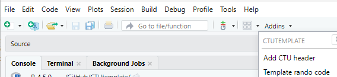

<!-- README.md is generated from README.Rmd. Please edit that file -->

```{r, echo = FALSE}
knitr::opts_chunk$set(
  collapse = TRUE,
  comment = "#>",
  fig.path = "man/figures/README-"
)
```

# `CTUtemplate` 

`r badger::badge_custom("dev version", as.character(packageVersion("CTUtemplate")), "blue", "https://github.com/CTU-Bern/CTUtemplate")`

`CTUtemplate` is a package to create a template directory structure (and files) and also includes the CTUs annual safety report function.


## Installation

`CTUtemplate` is easiest to install via 

```{r, eval = FALSE}
install.packages('CTUtemplate', repos = c('https://ctu-bern.r-universe.dev', 'https://cloud.r-project.org'))
```

Linux users might have to install from source:

```{r, eval = FALSE}
remotes::install_github("CTU-Bern/CTUtemplate")
```

This may require `Sys.setenv(R_REMOTES_NO_ERRORS_FROM_WARNINGS="true")` if packages were built under a different R version to the one you are using.

## Usage

```{r, message=FALSE}
library(CTUtemplate)
```


### Template director structure

Once installed, in RStudio, open a "new project in a new directory" and select "CTU project template". Options in the following window are used to create the folders and headers of R (and STATA) files. 

*Note:* `Directory name` would typically be e.g. `06_Analysis_xx_yy`, and `Create project as a subdirectory of` would be the `21_Statistics_yy` folder of the appropriate project (`yy` should be the same in both cases).

*IMPORTANT:* `Directory name` should not already exist as a subdirectory of `21_Statistics_yy`. Please delete (or rename) the existing folder. 

### Template randomisation list code

When using RStudio it's possible to open template code for generating and reporting on randomisation lists. Click the Addins menu at the top of the RStudio menu and select "Template rando code" (Addins are sorted by package). 



You can also open the template code via `CTUtemplate::template_rando_code()`.

There is also an addin to insert a header at the top of an open script ("Add CTU header").

### Quarto report templates

We now also have some quarto report templates (more still to come, perhaps). At least RStudio v2022.01.1+554 is required for working with them. 

Functions in `CTUtemplate` allow accessing the templates directly from R:

```{r, eval = FALSE}
# for a generic report
use_qmd_html("folder")

# for a template recruitment report
use_qmd_htmlrecruitment("folder")

# for a template sample size report
use_qmd_htmlsampsi("folder")

# for a revealjs presentation
use_qmd_pres("folder")

# for typst report, which renders to PDF
use_qmd_typst("folder")
```

The above functions will download the templates and other necessary files and (optionally) open the `qmd` file for you. You should specify the location to save the files

See also the [quarto template repo](https://github.com/CTU-Bern/quarto) for more info on our quarto templates. 

See the [quarto guide](https://quarto.org/docs/guide/) for loads of info.


### LaTeX Report templates

`CTUtemplate` has an Rmd template for sample size reports and a more generic template
with some examples of how to do things. 

|Function                   |Description
|:--------------------------|:---------------------------------------
|`use_report_template`      |Opens a generic file with various examples
|`use_ssreport_template`    |Opens a template for a sample size report 
|`use_recreport_template`   |Opens a template for a recruitment report
|`use_param_report_template`|Opens template files for using parameterized reports
|`use_ub_tex_template`      |Opens the UNIBE tex template allowing modifications for additional features of latex

The functions 
are used to open a new template in the location designated (the recommended location
would probably be `08_Reports_projnum`).

```{r, eval = FALSE}
# for a sample size report
use_ssreport_template("folder/ssreport.Rmd")
# for the examples
use_report_template("folder/report.Rmd")
# for a template recruitment report
use_recreport_template("folder/recreport.Rmd")
# for an example of a parameterized report (note the lack of file extension here)
use_param_report_template("folder/param_report")
```

The top of the header defines the location that the PDF is saved, relative to the Rmd. The `xx` in `08_Reports_xx` should be changed to the project number. `ReportName` on the following line could be changed to something else.

```
knit: (function(inputFile, encoding) { 
      rmarkdown::render(inputFile,
                        encoding=encoding, 
                        output_file=file.path(dirname(inputFile), 
                                              '../08_Reports_xx', 
                                              paste0("ReportName_",
                                                     Sys.Date(),
                                                     ".pdf"))) })
```

The templates for sample size calculations and recruitment reports refer to `ProjectName`. This should also be changed to something more meaningful.

If modifications to the latex template are desired, it can be copied to the folder via

```{r, eval = FALSE}
use_ub_tex_template("folder/report.tex")
```

The YAML header in the Rmd file then needs to be changed to include

```
output: 
  CTUtemplate::report_pdf:
    report_template: "report.tex"
```

Using this approach, other latex packages can be used to extend the capabilities of latex.


### Acknowledgements

The package logo was created with [`ggplot2`](https://ggplot2.tidyverse.org/) and [`hexSticker`](https://github.com/GuangchuangYu/hexSticker) with icons from [Font Awesome](https://fontawesome.com/) (via the [emojifont package](https://github.com/GuangchuangYu/emojifont)).
