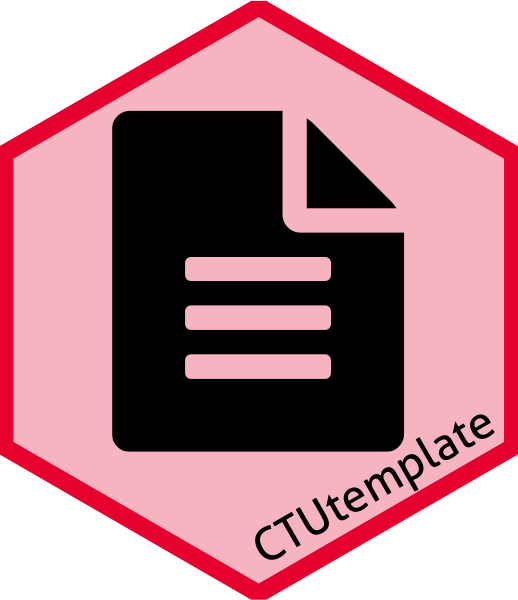
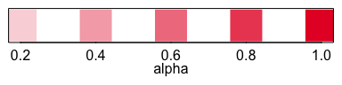

<!-- README.md is generated from README.Rmd. Please edit that file -->

# `CTUtemplate` 

[](https://github.com/CTU-Bern/CTUtemplate)

`CTUtemplate` is a package to create a template directory structure (and
files) and also includes the CTUs annual safety report function.

## Installation

`CTUtemplate` is easiest to install via

``` r
install.packages('CTUtemplate', repos = 'https://ctu-bern.r-universe.dev')
```

Linux users might have to install from source:

``` r
remotes::install_github("CTU-Bern/CTUtemplate")
```

This may require `Sys.setenv(R_REMOTES_NO_ERRORS_FROM_WARNINGS="true")`
if packages were built under a different R version to the one you are
using.

## Usage

``` r
library(CTUtemplate)
```

### Template director structure

Once installed, in RStudio, open a “new project in a new directory” and
select “CTU project template”. Options in the following window are used
to create the folders and headers of R (and eventually STATA) files.

### UNIBE Red

There is also a function for the UNIBEs shade of red:

``` r
par(mai = c(.5, .1, .1, .1), tck = -.01, mgp = c(1,.2,0))
plot(
  # main point:
  col = unibeRed(alpha = seq(.2, 1, .2)), 
  # other stuff for the figure
  x = seq(.2, 1, .2), y = rep(1,5), 
  pch = 15, cex = 5, xlab = "alpha", ylab = "", 
  yaxt = "n")
```



### Report templates

`CTUtemplate` has an Rmd template for sample size reports and a more
generic template with some examples of how to do things.

| Function                    | Description                                                                          |
| :-------------------------- | :----------------------------------------------------------------------------------- |
| `use_report_template`       | Opens a generic file with various examples                                           |
| `use_ssreport_template`     | Opens a template for a sample size report                                            |
| `use_recreport_template`    | Opens a template for a recruitment report                                            |
| `use_param_report_template` | Opens template files for using parameterized reports                                 |
| `use_ub_tex_template`       | Opens the UNIBE tex template allowing modifications for additional features of latex |

The functions are used to open a new template in the location designated
(the recommended location would probably be `08_Reports_projnum`).

``` r
# for a sample size report
use_ssreport_template("folder/ssreport.Rmd")
# for the examples
use_report_template("folder/report.Rmd")
# for a template recruitment report
use_recreport_template("folder/recreport.Rmd")
# for an example of a parameterized report (note the lack of file extension here)
use_param_report_template("folder/param_report")
```

If modifications to the latex template are desired, it can be copied to
the folder via

``` r
use_ub_tex_template("folder/report.tex")
```

The YAML header in the Rmd file then needs to be changed to include

    output: 
      CTUtemplate::report_pdf:
        report_template: "report.tex"

Using this approach, other latex packages can be used to extend the
capabilities of latex.

### Acknowledgements

The package logo was created with
[`ggplot2`](https://ggplot2.tidyverse.org/) and
[`hexSticker`](https://github.com/GuangchuangYu/hexSticker) with icons
from [Font Awesome](https://fontawesome.com/) (via the [emojifont
package](https://github.com/GuangchuangYu/emojifont)).
